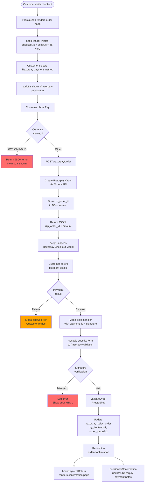
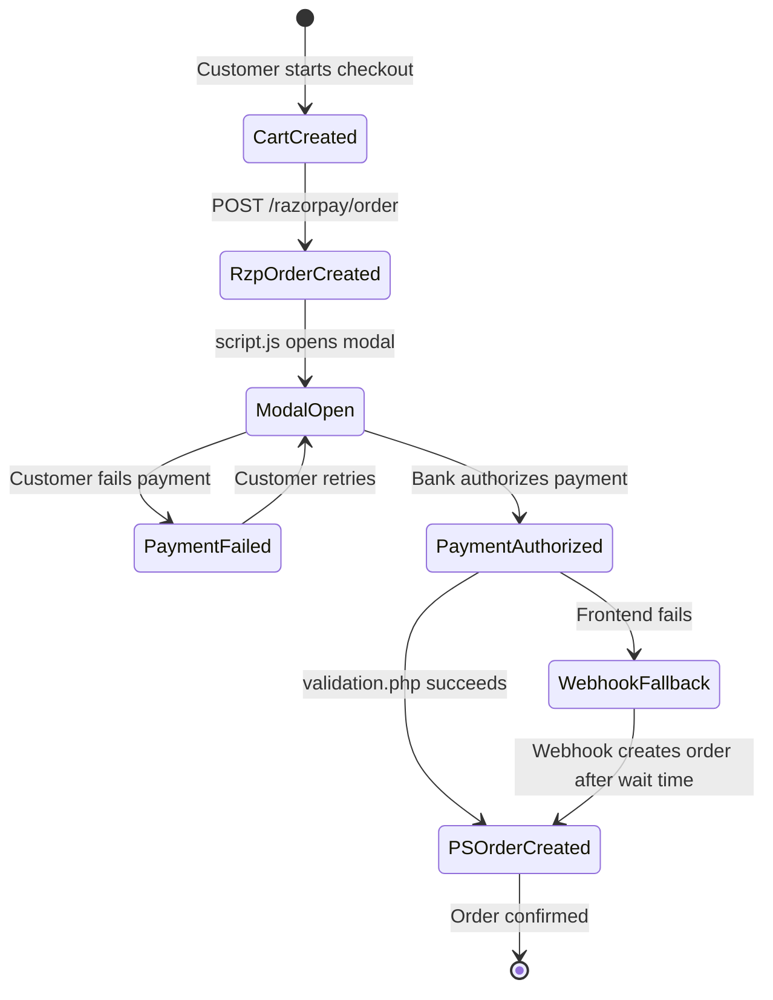

# HLD: Payment Flow — Razorpay PrestaShop

```mermaid
flowchart TD
    A([Customer visits checkout]) --> B[PrestaShop renders order page]
    B --> C[hookHeader injects checkout.js + script.js + JS vars]
    C --> D[Customer selects Razorpay payment method]
    D --> E[script.js shows #razorpay-pay-button]
    E --> F[Customer clicks Pay]

    F --> G{Currency\nallowed?}
    G -->|KWD/OMR/BHD| BLOCKED[Return JSON error\nNo modal shown]
    G -->|Other| H[POST /razorpay/order]

    H --> I[Create Razorpay Order\nvia Orders API]
    I --> J[Store rzp_order_id\nin DB + session]
    J --> K[Return JSON:\nrzp_order_id + amount]

    K --> L[script.js opens\nRazorpay Checkout Modal]
    L --> M[Customer enters\npayment details]
    M --> N{Payment\nresult}

    N -->|Failure| FAIL[Modal shows error\nCustomer retries]
    N -->|Success| O[Modal calls handler\nwith payment_id + signature]

    O --> P[script.js submits form\nto /razorpay/validation]
    P --> Q{Signature\nverification}
    Q -->|Mismatch| SIG_FAIL[Log error\nShow error HTML]
    Q -->|Valid| R[validateOrder\nPrestaShop]

    R --> S[Update razorpay_sales_order\nby_frontend=1, order_placed=1]
    S --> T[Redirect to\norder-confirmation]

    T --> U[hookPaymentReturn\nrenders confirmation page]
    T --> V[hookOrderConfirmation\nupdates Razorpay payment notes]

    style BLOCKED fill:#ff6b6b
    style FAIL fill:#ffa500
    style SIG_FAIL fill:#ff6b6b
```

## Payment States

```mermaid
stateDiagram-v2
    [*] --> CartCreated: Customer starts checkout
    CartCreated --> RzpOrderCreated: POST /razorpay/order
    RzpOrderCreated --> ModalOpen: script.js opens modal
    ModalOpen --> PaymentFailed: Customer fails payment
    ModalOpen --> PaymentAuthorized: Bank authorizes payment
    PaymentFailed --> ModalOpen: Customer retries
    PaymentAuthorized --> PSOrderCreated: validation.php succeeds
    PaymentAuthorized --> WebhookFallback: Frontend fails
    WebhookFallback --> PSOrderCreated: Webhook creates order after wait time
    PSOrderCreated --> [*]: Order confirmed
```
