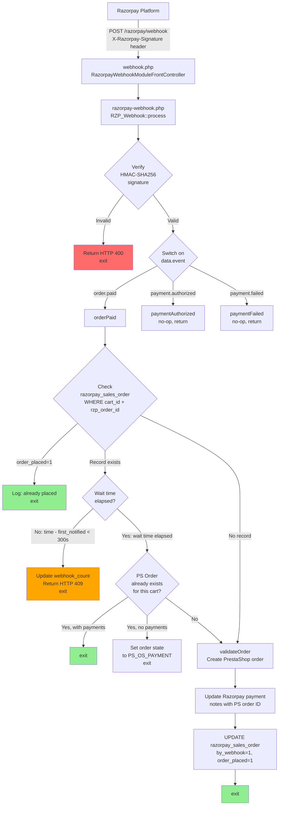
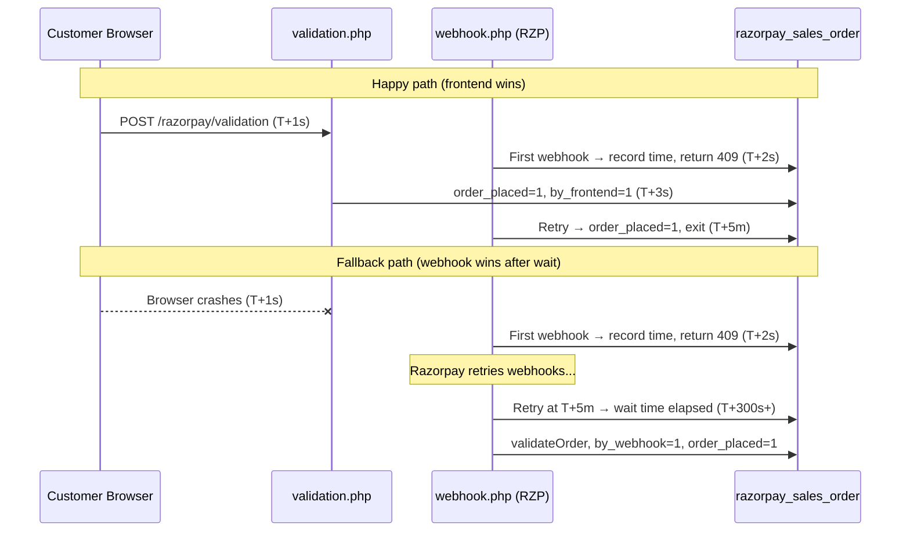

# HLD: Webhook Flow — Razorpay PrestaShop

```mermaid
flowchart TD
    RZP[Razorpay Platform] -->|POST /razorpay/webhook\nX-Razorpay-Signature header| ENTRY[webhook.php\nRazorpayWebhookModuleFrontController]

    ENTRY --> PROC[razorpay-webhook.php\nRZP_Webhook::process]

    PROC --> SIG{Verify\nHMAC-SHA256\nsignature}
    SIG -->|Invalid| HTTP400[Return HTTP 400\nexit]
    SIG -->|Valid| EVENT{Switch on\ndata.event}

    EVENT -->|order.paid| PAID[orderPaid]
    EVENT -->|payment.authorized| NOOP1[paymentAuthorized\nno-op, return]
    EVENT -->|payment.failed| NOOP2[paymentFailed\nno-op, return]

    PAID --> DB_CHECK{Check\nrazorpay_sales_order\nWHERE cart_id + rzp_order_id}

    DB_CHECK -->|order_placed=1| EXIT1[Log: already placed\nexit]
    DB_CHECK -->|Record exists| WAIT{Wait time\nelapsed?}
    DB_CHECK -->|No record| CREATE_ORDER

    WAIT -->|No: time - first_notified < 300s| HTTP409[Update webhook_count\nReturn HTTP 409\nexit]
    WAIT -->|Yes: wait time elapsed| PS_ORDER_CHECK

    PS_ORDER_CHECK{PS Order\nalready exists\nfor this cart?} -->|Yes, with payments| EXIT2[exit]
    PS_ORDER_CHECK -->|Yes, no payments| SET_STATE[Set order state\nto PS_OS_PAYMENT\nexit]
    PS_ORDER_CHECK -->|No| CREATE_ORDER

    CREATE_ORDER[validateOrder\nCreate PrestaShop order] --> UPDATE_NOTES[Update Razorpay payment\nnotes with PS order ID]
    UPDATE_NOTES --> UPDATE_DB[UPDATE razorpay_sales_order\nby_webhook=1, order_placed=1]
    UPDATE_DB --> EXIT3[exit]

    style HTTP400 fill:#ff6b6b
    style HTTP409 fill:#ffa500
    style EXIT1 fill:#90ee90
    style EXIT2 fill:#90ee90
    style EXIT3 fill:#90ee90
```

## Race Condition Timeline

```mermaid
sequenceDiagram
    participant C as Customer Browser
    participant V as validation.php
    participant W as webhook.php (RZP)
    participant DB as razorpay_sales_order

    Note over C,DB: Happy path (frontend wins)
    C->>V: POST /razorpay/validation (T+1s)
    W->>DB: First webhook → record time, return 409 (T+2s)
    V->>DB: order_placed=1, by_frontend=1 (T+3s)
    W->>DB: Retry → order_placed=1, exit (T+5m)

    Note over C,DB: Fallback path (webhook wins after wait)
    C--xV: Browser crashes (T+1s)
    W->>DB: First webhook → record time, return 409 (T+2s)
    Note over W: Razorpay retries webhooks...
    W->>DB: Retry at T+5m → wait time elapsed (T+300s+)
    W->>DB: validateOrder, by_webhook=1, order_placed=1
```
