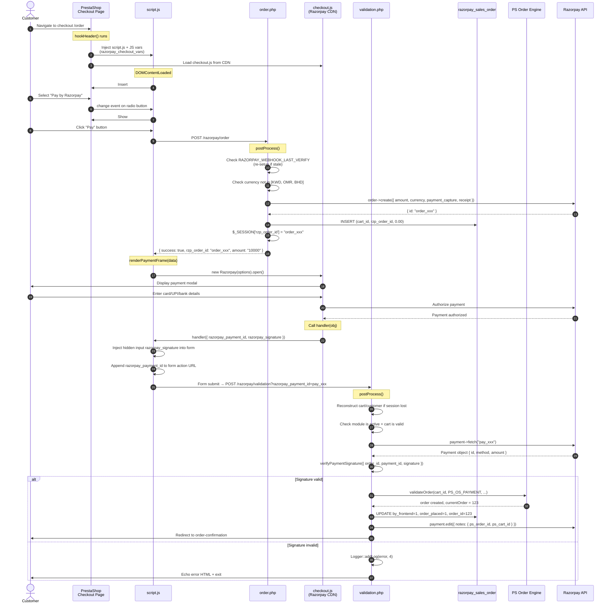

# LLD: Checkout Sequence — Razorpay PrestaShop

```mermaid
sequenceDiagram
    autonumber
    actor Customer
    participant PS as PrestaShop<br/>Checkout Page
    participant JS as script.js
    participant OrderCtrl as order.php
    participant CheckoutJS as checkout.js<br/>(Razorpay CDN)
    participant ValidCtrl as validation.php
    participant DB as razorpay_sales_order
    participant PSEngine as PS Order Engine
    participant RzpAPI as Razorpay API

    Customer->>PS: Navigate to checkout /order

    Note over PS: hookHeader() runs
    PS->>JS: Inject script.js + JS vars<br/>(razorpay_checkout_vars)
    PS->>CheckoutJS: Load checkout.js from CDN

    Note over JS: DOMContentLoaded
    JS->>PS: Insert #razorpay-pay-button<br/>(hidden initially)

    Customer->>PS: Select "Pay by Razorpay"
    PS->>JS: change event on radio button
    JS->>PS: Show #razorpay-pay-button

    Customer->>JS: Click "Pay" button
    JS->>OrderCtrl: POST /razorpay/order

    Note over OrderCtrl: postProcess()
    OrderCtrl->>OrderCtrl: Check RAZORPAY_WEBHOOK_LAST_VERIFY<br/>(re-setup if stale)
    OrderCtrl->>OrderCtrl: Check currency not in [KWD, OMR, BHD]
    OrderCtrl->>RzpAPI: order->create({ amount, currency, payment_capture, receipt })
    RzpAPI-->>OrderCtrl: { id: "order_xxx" }
    OrderCtrl->>DB: INSERT (cart_id, rzp_order_id, 0.00)
    OrderCtrl->>OrderCtrl: $_SESSION['rzp_order_id'] = "order_xxx"
    OrderCtrl-->>JS: { success: true, rzp_order_id: "order_xxx", amount: "10000" }

    Note over JS: renderPaymentFrame(data)
    JS->>CheckoutJS: new Razorpay(options).open()
    CheckoutJS->>Customer: Display payment modal

    Customer->>CheckoutJS: Enter card/UPI/bank details
    CheckoutJS->>RzpAPI: Authorize payment
    RzpAPI-->>CheckoutJS: Payment authorized

    Note over CheckoutJS: Call handler(obj)
    CheckoutJS->>JS: handler({ razorpay_payment_id, razorpay_signature })

    JS->>JS: Inject hidden input razorpay_signature into form
    JS->>JS: Append razorpay_payment_id to form action URL
    JS->>ValidCtrl: Form submit → POST /razorpay/validation?razorpay_payment_id=pay_xxx

    Note over ValidCtrl: postProcess()
    ValidCtrl->>ValidCtrl: Reconstruct cart/customer if session lost
    ValidCtrl->>ValidCtrl: Check module is active + cart is valid
    ValidCtrl->>RzpAPI: payment->fetch("pay_xxx")
    RzpAPI-->>ValidCtrl: Payment object { id, method, amount }
    ValidCtrl->>ValidCtrl: verifyPaymentSignature({ order_id, payment_id, signature })

    alt Signature valid
        ValidCtrl->>PSEngine: validateOrder(cart_id, PS_OS_PAYMENT, ...)
        PSEngine-->>ValidCtrl: order created, currentOrder = 123
        ValidCtrl->>DB: UPDATE by_frontend=1, order_placed=1, order_id=123
        ValidCtrl->>RzpAPI: payment.edit({ notes: { ps_order_id, ps_cart_id } })
        ValidCtrl->>Customer: Redirect to order-confirmation
    else Signature invalid
        ValidCtrl->>ValidCtrl: Logger::addLog(error, 4)
        ValidCtrl->>Customer: Echo error HTML + exit
    end
```
