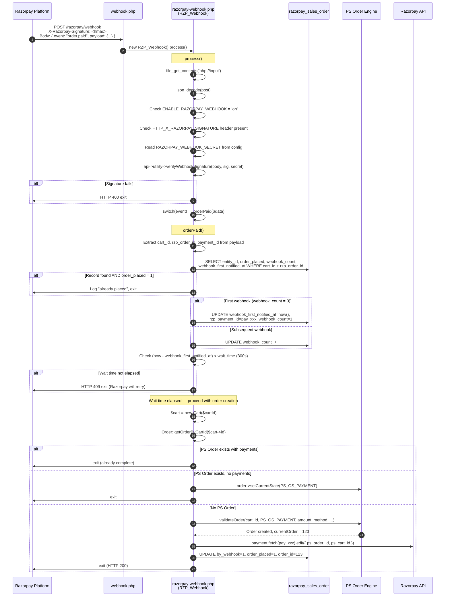

# LLD: Webhook Sequence — Razorpay PrestaShop

```mermaid
sequenceDiagram
    autonumber
    participant RZP as Razorpay Platform
    participant WHCtrl as webhook.php
    participant WHProc as razorpay-webhook.php<br/>(RZP_Webhook)
    participant DB as razorpay_sales_order
    participant PSEngine as PS Order Engine
    participant RzpAPI as Razorpay API

    RZP->>WHCtrl: POST /razorpay/webhook<br/>X-Razorpay-Signature: <hmac><br/>Body: { event: "order.paid", payload: {...} }

    WHCtrl->>WHProc: new RZP_Webhook().process()

    Note over WHProc: process()
    WHProc->>WHProc: file_get_contents('php://input')
    WHProc->>WHProc: json_decode(post)
    WHProc->>WHProc: Check ENABLE_RAZORPAY_WEBHOOK = 'on'
    WHProc->>WHProc: Check HTTP_X_RAZORPAY_SIGNATURE header present
    WHProc->>WHProc: Read RAZORPAY_WEBHOOK_SECRET from config

    WHProc->>WHProc: api->utility->verifyWebhookSignature(body, sig, secret)

    alt Signature fails
        WHProc->>RZP: HTTP 400 exit
    end

    WHProc->>WHProc: switch(event) → orderPaid($data)

    Note over WHProc: orderPaid()
    WHProc->>WHProc: Extract cart_id, rzp_order_id, payment_id from payload
    WHProc->>DB: SELECT entity_id, order_placed, webhook_count,<br/>webhook_first_notified_at WHERE cart_id + rzp_order_id

    alt Record found AND order_placed = 1
        WHProc->>RZP: Log "already placed", exit
    end

    alt First webhook (webhook_count = 0)
        WHProc->>DB: UPDATE webhook_first_notified_at=now(),<br/>rzp_payment_id=pay_xxx, webhook_count=1
    else Subsequent webhook
        WHProc->>DB: UPDATE webhook_count++
    end

    WHProc->>WHProc: Check (now - webhook_first_notified_at) < wait_time (300s)

    alt Wait time not elapsed
        WHProc->>RZP: HTTP 409 exit (Razorpay will retry)
    end

    Note over WHProc: Wait time elapsed — proceed with order creation
    WHProc->>WHProc: $cart = new Cart($cartId)
    WHProc->>WHProc: Order::getOrderByCartId($cart->id)

    alt PS Order exists with payments
        WHProc->>RZP: exit (already complete)
    else PS Order exists, no payments
        WHProc->>PSEngine: order->setCurrentState(PS_OS_PAYMENT)
        WHProc->>RZP: exit
    else No PS Order
        WHProc->>PSEngine: validateOrder(cart_id, PS_OS_PAYMENT, amount, method, ...)
        PSEngine-->>WHProc: Order created, currentOrder = 123
        WHProc->>RzpAPI: payment.fetch(pay_xxx).edit({ ps_order_id, ps_cart_id })
        WHProc->>DB: UPDATE by_webhook=1, order_placed=1, order_id=123
        WHProc->>RZP: exit (HTTP 200)
    end
```
